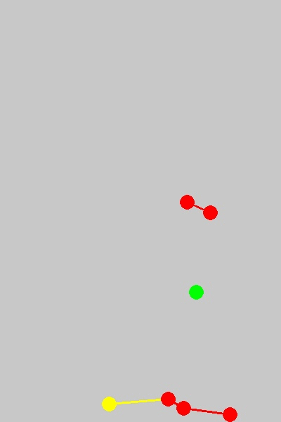

# Social Distancing AI
Tool to moniter social distancing from CCTV, videos using Python, Deep learning, Computer Vision.

## Demo

## Problem Statement:
    To moniter distance between persons from CCTV feeds or videos.
     
## Requirements:

    You will need the following to run the above:
    Python 3.5.2
    Opencv(CV2) 4.2.0
    numpy 1.14.5
    argparse
    
    For running: Good GPU, for faster results. CPU is also fine
    
## File Structure:

    main.py     : Detects and calculates distance between persons
    utills.py   : Contain functions to calculate distance, scale, transformed points
    plot.py     : Contain functions to draw bird eye view and frame
    models      : Contain yolo weights and cfg.(IMPT NOTE: weights file in not present because of size issue. 
                  It can be downloaded from here : https://pjreddie.com/media/files/yolov3.weights)
    data        : Contain video sample
    output      : Contain output frames
    output_vid  : Contain output videos(Empty for now)
      
## Usage:
        
     * If following same directory structure   
         python main.py
     * If paths for models, input video is different then given directory structure
         python main.py --model='model path' --video_path='path to video file' --output_dir='output directory' --output_vid='output vid directory'
         
## How it works:

     * Run following command(if directory structure is same) 
         python main.py
         
     * You will get a frame where you can draw ROI and distance scale. It will take 8 points on first frame using mouse click        event.First four points will define ROI where we want to moniter social distancing. Also these points should form 
       parallel lines in real world if seen from above(birds eye view). Next 3 points will define 6 feet(unit length) 
       distance in horizontal and vertical direction and those should form parallel lines with ROI. Unit length we can take 
       based on choice. Points should pe in pre-defined order - bottom-left, bottom-right, top-right, top-left, point 5 and 6 
       should form horizontal line and point 5 and 7 should form verticle line. Horizontal and vertical scale will be 
       different. Gif below will help understand points better.
             
       
       
## Output:

Bird's Eye View       
 

Output frames

    
More result frames are in output folder

## Idea Credits

Landing.ai

## License:

Copyright © 2020, [Deepak Birla](https://github.com/deepak112). Released under the [MIT License](https://github.com/deepak112/Social-Distancing-AI/blob/master/LICENSE).

