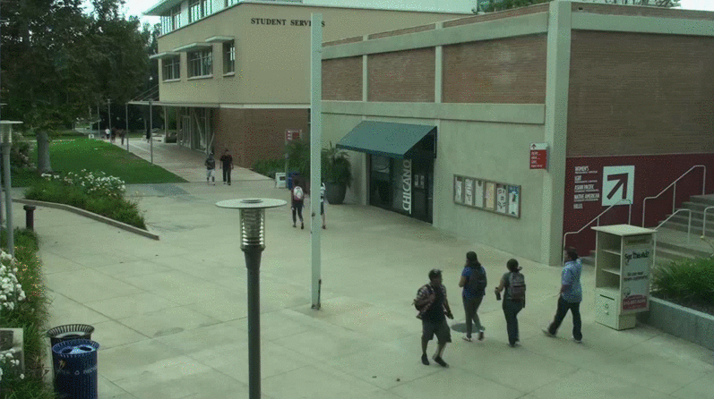

# Social Distancing AI
   Tool to monitor social distancing from CCTV, videos using Python, Deep learning, Computer Vision. This tool can 
   automatically estimate interpersonal distance from uncalibrated RGB cameras. Can be used at public places and workplace.

   In the fight against the COVID-19, social distancing has proven to be a very effective measure. To ensure social
   distancing protocol in public places and workplace, I have developed social distancing detection tool that can monitor
   if people are keeping a safe distance from each other by analyzing real time video streams from the camera.

   This tool has following features:

   * Detect humans in the frame with yolov3.
   * Calculates the distance between every human who is detected in the frame.
   * Shows how many people are at High, Low and Not at risk.
   
   To can find more about this topic in my post : [Social Distancing AI](https://medium.com/@birla.deepak26/social-distancing-ai-using-python-deep-learning-c26b20c9aa4c)

## Demo:

    
## Requirements:

    You will need the following to run this code:
    Python 3.5.2
    Opencv(CV2) 4.2.0
    numpy 1.14.5
    argparse
    
    For human detection:
    yolov3.weights, yolov3.cfg files (weights file in not present because of size issue. It can be downloaded from 
    here : https://pjreddie.com/media/files/yolov3.weights)
    
    For running: 
    Good GPU, for faster results. CPU is also fine
    
## File Structure:

    main.py     : Detects and calculates distance between humans
    utills.py   : Contain functions to calculate distance, scale, transformed points
    plot.py     : Contain functions to draw bird eye view and frame
    models      : Contain yolo weights and cfg.(IMPT NOTE: weights file in not present because of size issue. 
                  It can be downloaded from here : https://pjreddie.com/media/files/yolov3.weights)
    data        : Contain video sample
    output      : Contain output frames
    output_vid  : Contain output videos(Empty for now)
      
## Usage:
        
     * If following same directory structure   
         python main.py
     * If paths for models, input video is different then given directory structure
         python main.py --model='model path' --video_path='path to video file' --output_dir='output directory' --output_vid='output vid directory'
         
## How it works:

     * Run following command(if directory structure is same) 
         python main.py
         
     * You will get a frame where you can draw ROI and distance scale. It will take 8 points on first frame using mouse click 
       event. First four points will define ROI where we want to monitor social distancing. Also these points should form 
       parallel lines in real world if seen from above(birds eye view). Next 3 points will define 6 feet(unit length) 
       distance in horizontal and vertical direction and those should form parallel lines with ROI. Unit length we can take 
       based on choice. Points should pe in pre-defined order - bottom-left, bottom-right, top-right, top-left, point 5 and 6 
       should form horizontal line and point 5 and 7 should form verticle line. Horizontal and vertical scale will be
       different. Gif below will help understand points better.
       
     * We will transform prespective of ROI so that we can have top view of scene or ROI. This top view or bird eye view has 
       the property that points are distributed uniformally horizontally and vertically(scale for horizontal and vertical 
       direction will be different). So for bird eye view points are equally distributed, which was not case for normal view.
       
     * YOLO V3 is used to detect humans in frame and by calculating bottom center point of bounding boxe around humans, 
       we transform those points to bird eye view. And then calculates risk factor by calculating distance between
       points and then drawing birds eye view and drawing bounding boxes and distance lines between boxes on frame.
       
     * Distance calculation works best for ROI.
             

       
## Output:

   Bird's Eye View       
 

   Output frames

    
More result frames are in output folder

## Documentation:

   You can find more about this implementation in my post :[Social Distancing AI](https://medium.com/@birla.deepak26/social-distancing-ai-using-python-deep-learning-c26b20c9aa4c)

## Idea Credits:

   [Landing.ai](https://landing.ai/landing-ai-creates-an-ai-tool-to-help-customers-monitor-social-distancing-in-the-workplace/)
   
## References:

   Yolov3 object detection : https://www.learnopencv.com/deep-learning-based-object-detection-using-yolov3-with-opencv-python-c/
   Prespective Transform : https://opencv-python-tutroals.readthedocs.io/en/latest/py_tutorials/py_imgproc/py_geometric_transformations/py_geometric_transformations.html

## License:

   Copyright © 2020, [Deepak Birla](https://github.com/deepak112). 
   Released under the [MIT License](https://github.com/deepak112/Social-Distancing-AI/blob/master/LICENSE).

